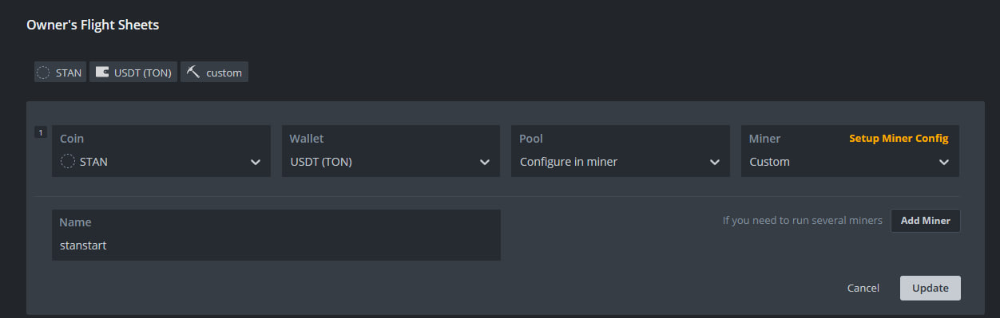

Hive Os client for StanMiner (https://stanvps.ddns.net/)

# Info

There is a problem with determining the correct miner and algorithm in the Hive OS panel

Hashrate information is taken from the Stun Miner log line:

``2024-11-04 12:29:34,501 - INFO - STAN LOG LINE: hashrate - 13372.5 H/S``

**Hive OS does not support the installation of two custom miners.**
A possible solution is to replace one of the standard miner. See "Replace rhminer with stanminer to run two custom miners"

# Install

Install the necessary packages if you haven't already:

```
sudo apt install cron screen lm-sensors python3-pip python3-requests python3-psutil psmisc unzip libhwloc15 libsodium23
```

## New wallet

Coin (create new): ``STAN``

Address (your TON address for USDT): ``UQCFVXtlCUjTY5n1zdwXbALgsbYQK1WrZUfAzU3shSyMx5D8``

Name: ``USDT (TON)``


## Flight Sheet

Coin: ``Stan``

Wallet: ``USDT (TON)``

Pool: ``Configure in miner``

Miner: ``Custom``



## Custom miner config

Miner name: ``stanstart``

Installation URL: ``https://github.com/DarkRiDDeR/stanminer-client-hiveos/releases/download/v0.0.2-alpha/stanstart-0.0.2alpha.tar.gz``

Hash algorithm: ``---``

Wallet and worker template: ``%WORKER_NAME%``

Pool URL: ``https://stanvps.ddns.net:8101``

Extra config arguments: ``--wallet %WAL% --threads 28``


# Replace rhminer with stanminer to run two custom miners 

Hive OS does not support the installation of two custom miners. A possible solution is to replace one of the standard miner. An example will be for replacing the rhminer-2.3 miner

Install rhminer 2.3: ``apt install hive-miners-rhminer hive-miners-rhminer-2.3``

open dir: ``cd /hive/miners/``

then: ``ls``

example result: ``custom/  rhminer/  srbminer/  teamredminer/``

delete rhminer dir: ``rm -rf rhminer``

download special version of stanminer client: ``wget https://github.com/DarkRiDDeR/stanminer-client-hiveos/releases/download/v0.0.2-alpha/replace_rhminer2.3_stanstart-0.0.2alpha.tar.gz``

untar: ``tar -xzf replace_rhminer2.3_stanstart-0.0.2alpha.tar.gz``

**or combined command:**

``apt install hive-miners-rhminer hive-miners-rhminer-2.3 && cd /hive/miners/ && rm -rf rhminer && (rm -f replace_rhminer2.3_* || true) && wget https://github.com/DarkRiDDeR/stanminer-client-hiveos/releases/download/v0.0.2-alpha/replace_rhminer2.3_stanstart-0.0.2alpha.tar.gz && tar -xzf replace_rhminer2.3_stanstart-0.0.2alpha.tar.gz``

## Flight Sheet

Coin: ``Stan``

Wallet: ``USDT (TON)``

Pool: ``Configure in miner``

Miner: ``RandomHash miner``


## Miner config

Wallet and worker template: ``%WORKER_NAME%``

Pool URL: ``stanvps.ddns.net:8101``

Extra config arguments: ``--wallet %WAL% --threads 28``

Version: ``2.3``


# Code examples

https://github.com/minershive/hiveos-linux/tree/master/hive/miners/custom

https://github.com/HaloGenius/hiveos-custom-miner/

https://github.com/MoneroOcean/hiveos/tree/main/mo_xmrig

# License

MIT License